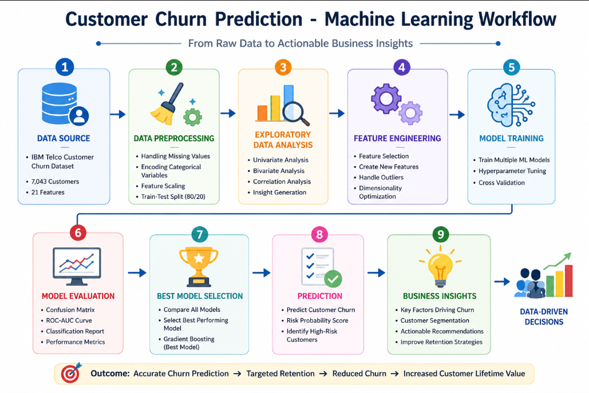
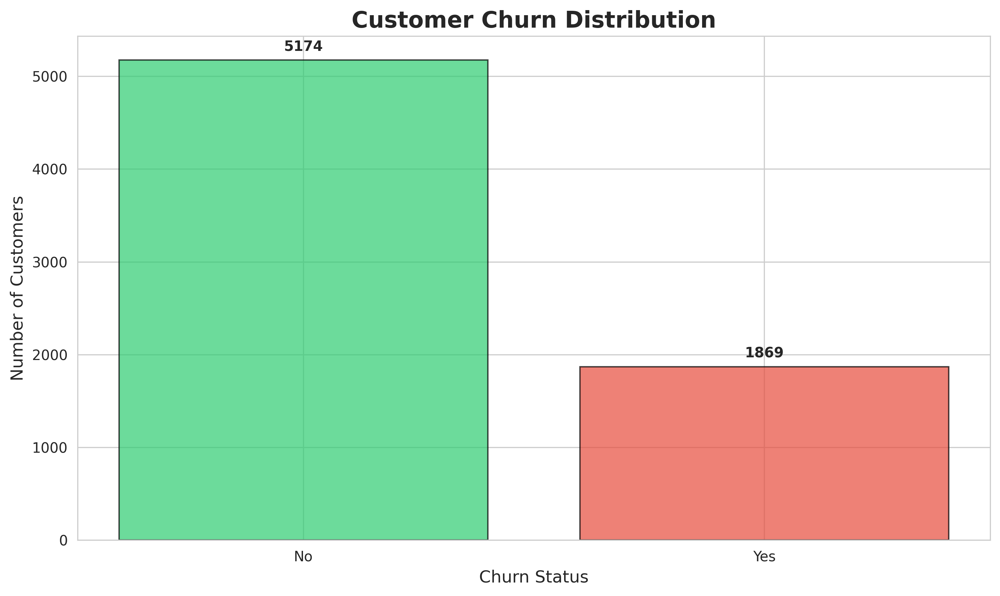
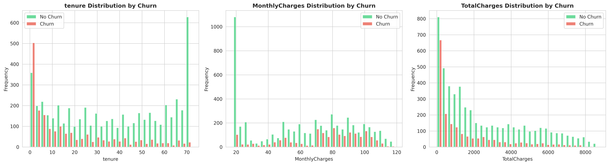
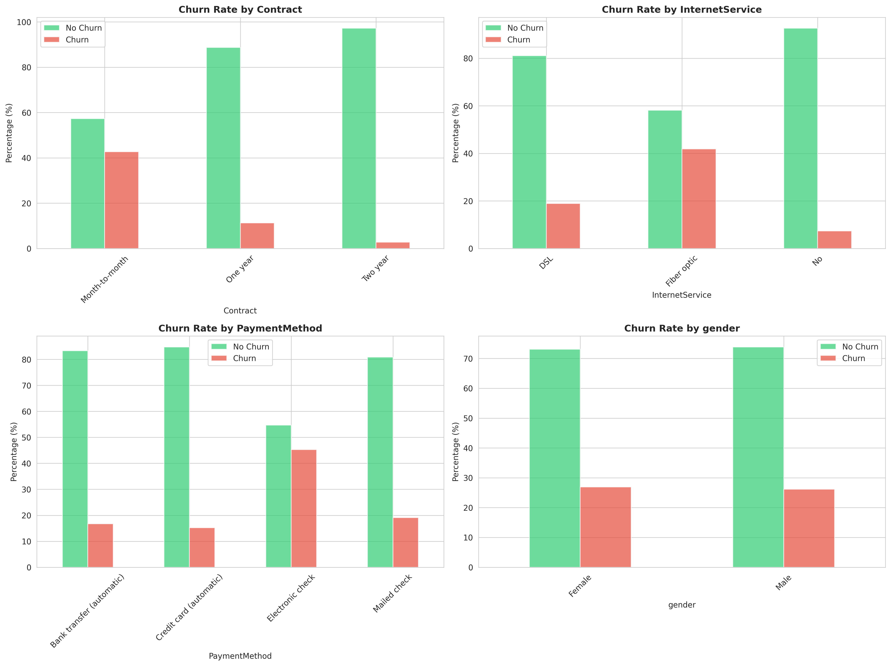
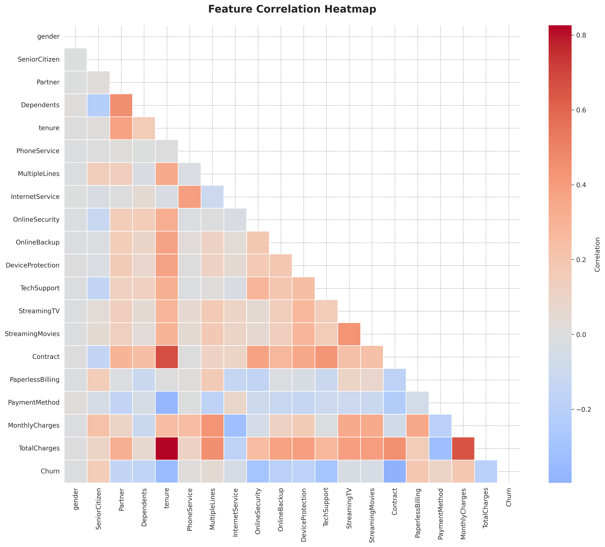
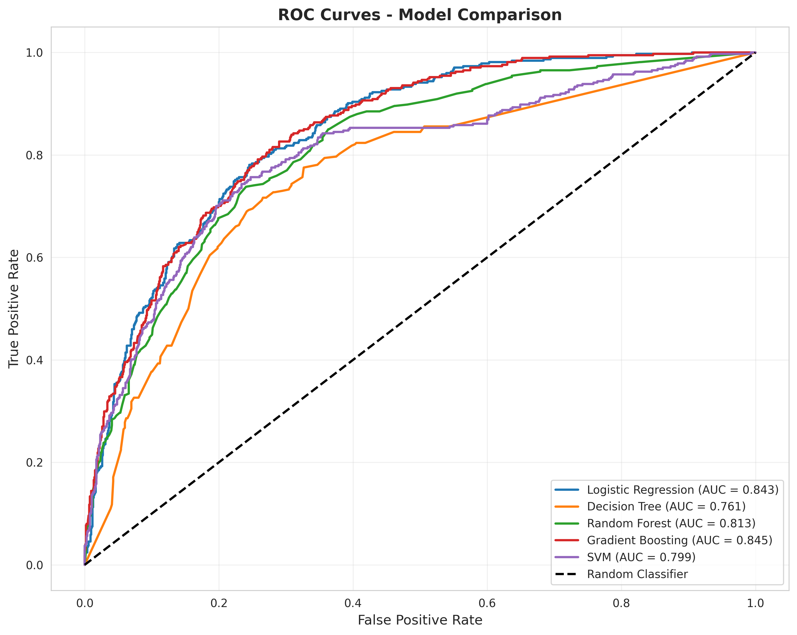
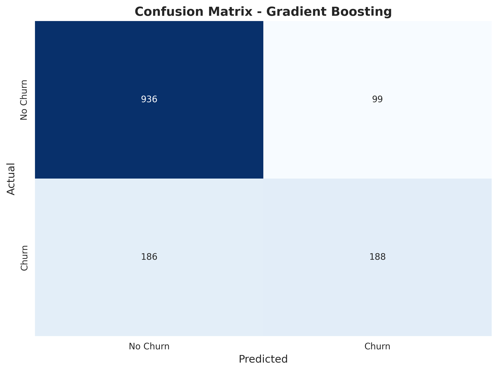
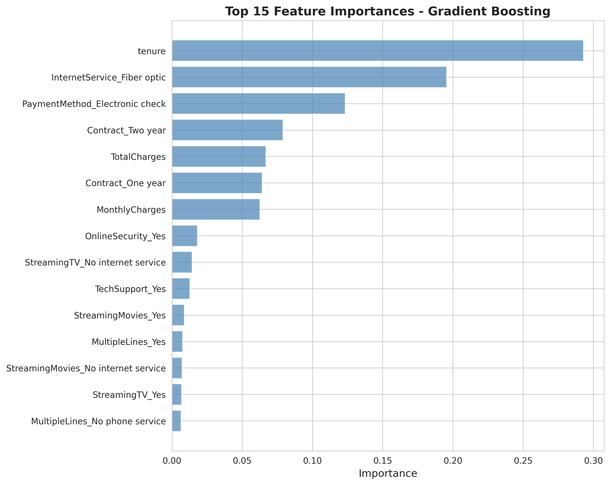

# 🤖 Customer Churn Analytics & Retention Modeling


An end-to-end **Machine Learning classification project** that predicts customer churn for a telecommunications company using the **IBM Telco Customer Churn Dataset**. The project demonstrates the complete machine learning lifecycle, including data preprocessing, exploratory data analysis, feature engineering, model comparison, hyperparameter tuning, and business insight generation.

---

# 📌 Project Overview

Customer churn is one of the most important business challenges faced by subscription-based companies. Acquiring a new customer is often significantly more expensive than retaining an existing one. Being able to accurately identify customers who are likely to leave allows businesses to take proactive retention actions.

This project develops a supervised machine learning solution capable of predicting customer churn based on customer demographics, account information, subscription services, and billing behavior.

The project covers every stage of a real-world machine learning workflow, including:

- Data Cleaning & Preprocessing
- Exploratory Data Analysis (EDA)
- Feature Engineering
- Model Development
- Model Evaluation
- Hyperparameter Tuning
- Business Recommendations

---

# 🎯 Business Problem

Telecommunication companies lose thousands of customers every year due to service dissatisfaction, pricing issues, contract flexibility, and competitive alternatives.

Without predictive analytics, companies often react **after** a customer has already decided to leave.

The objective of this project is to build a predictive machine learning model capable of identifying high-risk customers before churn occurs, enabling businesses to improve customer retention and reduce revenue loss.

---

# 💡 Solution

A complete machine learning pipeline was developed to classify customers into two categories:

- **No Churn**
- **Churn**

The solution includes:

- Cleaning and preprocessing customer data
- Encoding categorical variables
- Feature engineering
- Training multiple classification algorithms
- Comparing model performance using multiple evaluation metrics
- Selecting the best-performing model
- Identifying the most influential churn factors
- Generating business recommendations based on model insights

---

# 📊 Dataset Information

This project uses the **IBM Telco Customer Churn Dataset**, one of the most widely used benchmark datasets for customer retention modeling.

| Attribute | Details |
|------------|---------|
| Domain | Telecommunications |
| Customers | 7,043 |
| Features | 21 |
| Target Variable | Churn |
| Problem Type | Binary Classification |

The dataset contains customer demographic information, subscription services, billing details, contract information, payment methods, and customer tenure.

---

# 🎯 Project Objectives

The primary objectives of this project are to:

- Predict whether a customer is likely to churn
- Compare multiple machine learning algorithms
- Identify the most important factors influencing customer churn
- Evaluate classification performance using industry-standard metrics
- Generate actionable business recommendations
- Demonstrate a complete end-to-end machine learning workflow

---

# ❓ Business Questions Answered

This project helps answer key business questions such as:

- Which customers are most likely to churn?
- Which customer segments should receive retention campaigns?
- Which customer attributes contribute most to churn?
- Which services increase customer churn risk?
- Which retention strategies can improve customer loyalty?

---

# 🏗 Machine Learning Workflow



This project follows a standard supervised machine learning pipeline:

```text
IBM Telco Customer Dataset
        │
        ▼
Data Cleaning & Preprocessing
        │
        ▼
Exploratory Data Analysis
        │
        ▼
Feature Engineering
        │
        ▼
Model Training
        │
        ▼
Model Evaluation
        │
        ▼
Hyperparameter Tuning
        │
        ▼
Business Insights & Recommendations
```

---

# 📊 Exploratory Data Analysis (EDA)

Exploratory Data Analysis was performed to better understand customer behavior, identify relationships between variables, detect class imbalance, and uncover the primary drivers of customer churn.

The analysis focused on:

- Customer demographics
- Contract types
- Internet service usage
- Payment methods
- Monthly and total charges
- Customer tenure
- Feature correlations
- Churn distribution

EDA helped identify important business patterns that later contributed to feature engineering and model development.

---

# 📉 Customer Churn Distribution



The dataset shows a clear class imbalance, with the majority of customers remaining active while approximately one-quarter of customers have churned.

Understanding this imbalance is important because evaluation metrics such as **ROC-AUC**, **Precision**, and **Recall** become more meaningful than relying solely on accuracy.

---

# 📈 Numerical Feature Analysis



Numerical variables such as **tenure**, **Monthly Charges**, and **Total Charges** were analyzed to understand how customer behavior differs between churned and retained customers.

Key observations include:

- Customers with shorter tenure exhibit significantly higher churn rates.
- Customers paying higher monthly charges are more likely to leave.
- Long-term customers generally demonstrate stronger loyalty.

---

# 📊 Categorical Feature Analysis



Categorical variables such as **Contract Type**, **Internet Service**, **Payment Method**, and **Gender** were examined to identify relationships with customer churn.

The analysis revealed that customer churn is strongly influenced by subscription type, contract duration, and payment preferences.

---

# 🔥 Correlation Analysis



Correlation analysis was used to identify relationships among numerical and encoded categorical variables.

Although customer churn depends on multiple interacting factors, several variables such as tenure, contract type, monthly charges, and payment method demonstrated meaningful relationships with churn behavior.

---

# ⚙️ Feature Engineering

Before training the machine learning models, several preprocessing and feature engineering steps were performed to improve data quality and model performance.

The preprocessing pipeline included:

- Handling missing values
- Encoding categorical variables
- Converting binary categorical features into numerical format
- Standardizing numerical features where required
- Splitting the dataset into training and testing sets
- Preparing data for multiple classification algorithms

These preprocessing steps ensured that the models received clean, structured, and machine-learning-ready data.

---

# 🤖 Machine Learning Models

Multiple supervised machine learning algorithms were trained and evaluated to identify the most effective model for customer churn prediction.

The following classification algorithms were implemented:

- Logistic Regression
- Decision Tree Classifier
- Random Forest Classifier
- Gradient Boosting Classifier
- Support Vector Machine (SVM)

Each model was evaluated using multiple performance metrics rather than relying solely on accuracy.

---

# 📊 Model Comparison

| Model | Accuracy | ROC-AUC | Performance |
|--------|---------:|---------:|-------------|
| Logistic Regression | 79.70% | 84.32% | Excellent Baseline |
| Decision Tree | 75.44% | 76.09% | Moderate |
| Random Forest | 78.28% | 81.29% | Strong |
| ⭐ Gradient Boosting | **79.77%** | **84.46%** | **Best Overall** |
| Support Vector Machine | 78.64% | 79.88% | Good |

Although several models achieved similar accuracy, **Gradient Boosting** achieved the highest ROC-AUC score, making it the most reliable model for identifying customers at risk of churn.

---

# 🏆 Best Model Selection

Gradient Boosting was selected as the final production model because it provided the strongest balance between:

- Accuracy
- Precision
- Recall
- ROC-AUC

Unlike relying solely on prediction accuracy, ROC-AUC provides a better evaluation for customer churn datasets where class imbalance exists.

The model was further optimized using hyperparameter tuning, resulting in improved predictive performance.

---

# 📈 ROC Curve Comparison



Receiver Operating Characteristic (ROC) curves were used to compare model performance across all classification algorithms.

The comparison demonstrates that **Gradient Boosting consistently achieved the highest Area Under the Curve (AUC)**, indicating stronger discrimination between churned and retained customers.

---

# 📊 Confusion Matrix



The confusion matrix illustrates the model's prediction performance on unseen test data.

It highlights:

- Correctly predicted retained customers
- Correctly predicted churned customers
- False positives
- False negatives

This provides a more detailed understanding of model performance beyond simple accuracy.

---

# ⭐ Feature Importance



Feature importance analysis revealed the variables that contributed most significantly to customer churn prediction.

The most influential features include:

- Customer Tenure
- Internet Service Type
- Contract Type
- Monthly Charges
- Payment Method
- Total Charges

These variables provide valuable business insights into the factors that influence customer retention.

---

# 💡 Key Business Insights

Analysis of customer behavior revealed several important patterns.

### 📅 Customer Tenure

Customers in their first year are significantly more likely to churn than long-term customers.

---

### 📄 Contract Type

Month-to-month customers demonstrate substantially higher churn rates compared to customers on annual or two-year contracts.

---

### 🌐 Internet Service

Customers subscribed to Fiber Optic internet services exhibit higher churn compared to DSL users, suggesting opportunities to improve customer satisfaction.

---

### 💳 Payment Method

Customers using Electronic Check payment methods experience higher churn than customers using automatic payment options.

---

### 🛡 Value Added Services

Customers without Online Security, Tech Support, or Device Protection are more likely to leave the service.

---

# 📈 Business Recommendations

Based on the analytical findings, the following recommendations can help reduce customer churn.

### 1️⃣ Improve New Customer Retention

Develop onboarding programs targeting customers during their first 12 months.

---

### 2️⃣ Promote Long-Term Contracts

Offer discounts and loyalty incentives encouraging customers to transition from month-to-month contracts to annual plans.

---

### 3️⃣ Improve Fiber Internet Experience

Investigate service quality issues affecting Fiber Optic customers and implement customer satisfaction initiatives.

---

### 4️⃣ Encourage Automatic Payments

Promote AutoPay incentives to reduce churn associated with Electronic Check payment methods.

---

### 5️⃣ Bundle Value-Added Services

Increase adoption of Online Security, Tech Support, and Device Protection by offering bundled subscription packages.

---

# 💻 Technology Stack

| Category | Technologies |
|-----------|--------------|
| Programming Language | Python 3.x |
| Machine Learning | Scikit-Learn |
| Data Manipulation | Pandas, NumPy |
| Data Visualization | Matplotlib, Seaborn |
| Model Evaluation | ROC-AUC, Accuracy, Precision, Recall, F1-Score |
| Development Environment | Jupyter Notebook |
| Dataset | IBM Telco Customer Churn Dataset |

---

# 📁 Repository Structure

```text
Customer-Churn-Analytics/
│
├── assets/
│   └── ml-workflow.png
│
├── plots/
│   ├── churn-distribution.png
│   ├── numerical-analysis.png
│   ├── categorical-analysis.png
│   ├── correlation-heatmap.png
│   ├── feature-importance.png
│   ├── model-comparison.png
│   ├── confusion-matrix.png
│   └── roc-curves.png
│
├── Customer_Churn_Analytics.ipynb
├── README.md
├── requirements.txt
├── results_summary.txt
└── LICENSE
```

---

# 🚀 Getting Started

## Prerequisites

Install the required Python packages.

```bash
pip install pandas numpy matplotlib seaborn scikit-learn
```

---

## Clone Repository

```bash
git clone https://github.com/rudrasave/Customer-Churn-Analytics.git

cd Customer-Churn-Analytics
```

---

## Run the Notebook

```bash
jupyter notebook Customer_Churn_Analytics.ipynb
```

Run all notebook cells sequentially to reproduce the complete machine learning pipeline, visualizations, and model evaluation.

---

# 📈 Results Summary

The final Gradient Boosting model achieved strong predictive performance on unseen customer data.

| Metric | Value |
|---------|-------|
| Dataset Size | 7,043 Customers |
| Features | 21 |
| Best Model | Gradient Boosting |
| Accuracy | 79.77% |
| ROC-AUC | 84.46% |
| Classification Problem | Binary |

The model successfully identifies high-risk customers while maintaining strong overall predictive performance.

---

# 🎯 Business Impact

This project demonstrates practical Machine Learning and Business Analytics capabilities including:

- End-to-End Machine Learning Pipeline
- Exploratory Data Analysis (EDA)
- Feature Engineering
- Customer Segmentation
- Classification Modeling
- Hyperparameter Tuning
- Predictive Analytics
- Business Intelligence
- Customer Retention Strategy
- Data-Driven Decision Making

---

# 🔮 Future Improvements

Potential enhancements for future versions include:

- XGBoost and LightGBM implementation
- Explainable AI using SHAP values
- Customer Lifetime Value (CLV) prediction
- Streamlit web application deployment
- Docker containerization
- Real-time churn prediction API
- Automated model retraining pipeline
- Cloud deployment using Azure or AWS

---

# 📜 License

This project is licensed under the **MIT License**.

---

# 👨‍💻 Author

**Rudra Save**

📧 Email: **rudrasave1709@gmail.com**

🔗 LinkedIn:
https://www.linkedin.com/in/rudra-save-a90749358/

💻 GitHub:
https://github.com/rudrasave

---

## ⭐ Support

If you found this project helpful, consider giving it a **⭐ Star** on GitHub.

It helps others discover the project and supports future open-source work.

